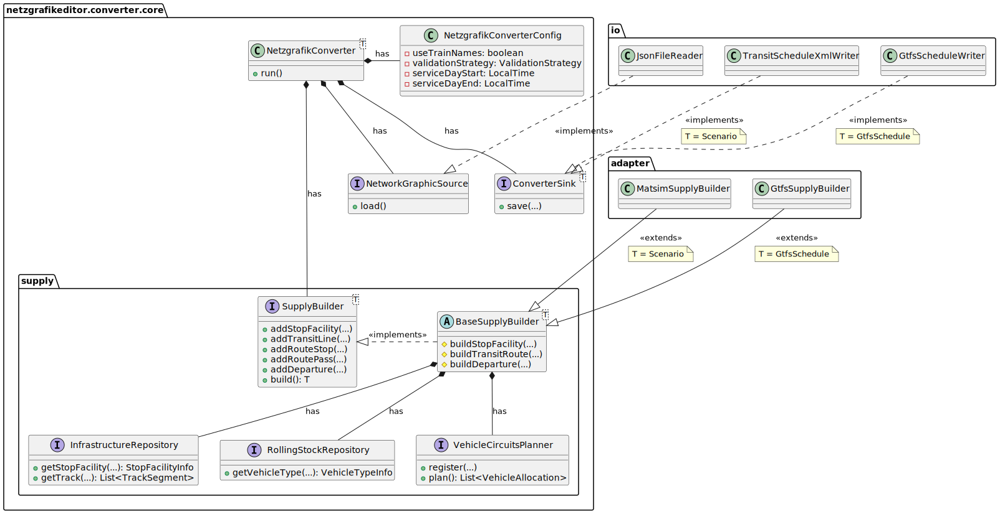

# Netzgrafik-Editor MATSim Converter

This tool converts network graphics from
the [Netzgrafik-Editor](https://github.com/SchweizerischeBundesbahnen/netzgrafik-editor-frontend) into MATSim transit
schedules.

## Design

The converter has a modular design (DI):

- **converter**: Reads a network graphic from a source, converts it, and writes to a sink.
    - **model**: DTOs to read network graphic data from JSON.
    - **supply**: A generic supply builder interface. Defines infrastructure and rolling stock repositories, as well as
      vehicle circuits planner interfaces used in the builder.
    - **matsim**: MATSim-specific transit schedule builder, implementing the supply builder interface.
    - **io**: Provides implementations for network graphic sources and converter output sinks.

The class diagram outlines the core classes and their relationships:



## Usage

```sh
# configure arguments
NETWORK_GRAPHIC_FILE=integration-test/input/networkGraphic.json
OUTPUT_DIRECTORY=integration-test/output/

# run spring command line runner app
./mvnw spring-boot:run -Dspring-boot.run.arguments="$NETWORK_GRAPHIC_FILE $OUTPUT_DIRECTORY"
```

## License

This project is licensed under [Apache 2.0](LICENSE).
