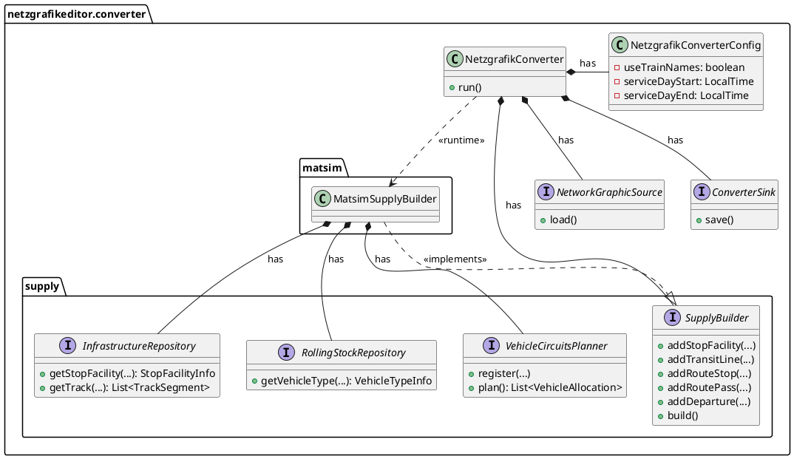

# Class Diagram

```plantuml
@startuml
set namespaceSeparator none
top to bottom direction

package netzgrafikeditor.converter {
    class NetzgrafikConverter {
        +run()
    }

    class NetzgrafikConverterConfig {
        -useTrainNames: boolean
        -serviceDayStart: LocalTime
        -serviceDayEnd: LocalTime
    }

    interface NetworkGraphicSource {
        +load()
    }

    interface ConverterSink {
        +save()
    }

    package supply {
        interface SupplyBuilder {
            +addStopFacility(...)
            +addTransitLine(...)
            +addRouteStop(...)
            +addRoutePass(...)
            +addDeparture(...)
            +build()
        }

        interface InfrastructureRepository {
            +getStopFacility(...): StopFacilityInfo
            +getTrack(...): List<TrackSegment>
        }

        interface RollingStockRepository {
            +getVehicleType(...): VehicleTypeInfo
        }

        interface VehicleCircuitsPlanner {
            +register(...)
            +plan(): List<VehicleAllocation>
        }
    }

    package matsim {
        class MatsimSupplyBuilder {
        }
    }
}

NetzgrafikConverter *- NetzgrafikConverterConfig : has
NetzgrafikConverter *-- NetworkGraphicSource : has
NetzgrafikConverter *--- SupplyBuilder : has
NetzgrafikConverter *-- ConverterSink : has
NetzgrafikConverter ..> MatsimSupplyBuilder : <<runtime>>

MatsimSupplyBuilder .|> SupplyBuilder: <<implements>>
MatsimSupplyBuilder *-- InfrastructureRepository : has
MatsimSupplyBuilder *-- RollingStockRepository : has
MatsimSupplyBuilder *-- VehicleCircuitsPlanner : has
@enduml
```
