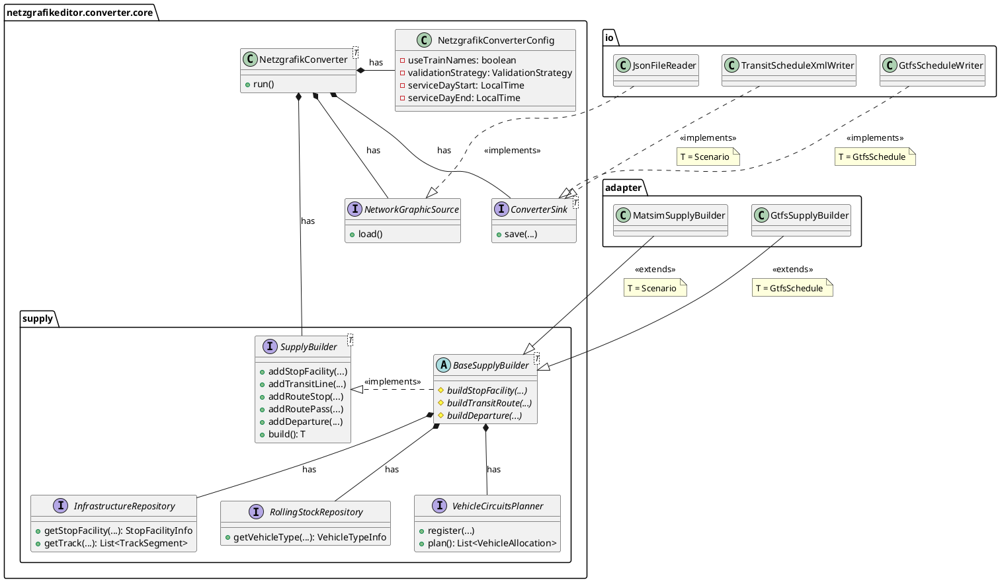

# Class Diagram

```plantuml
@startuml
set namespaceSeparator none
top to bottom direction

package netzgrafikeditor.converter.core {
    class NetzgrafikConverter<T> {
        +run()
    }

    class NetzgrafikConverterConfig {
        -useTrainNames: boolean
        -validationStrategy: ValidationStrategy
        -serviceDayStart: LocalTime
        -serviceDayEnd: LocalTime
    }

    interface NetworkGraphicSource {
        +load()
    }

    interface ConverterSink<T> {
        +save(...)
    }

    package supply {
        interface SupplyBuilder<T> {
            +addStopFacility(...)
            +addTransitLine(...)
            +addRouteStop(...)
            +addRoutePass(...)
            +addDeparture(...)
            +build(): T
        }

        abstract class BaseSupplyBuilder<T> {
            #{abstract}buildStopFacility(...)
            #{abstract}buildTransitRoute(...)
            #{abstract}buildDeparture(...)
        }

        interface InfrastructureRepository {
            +getStopFacility(...): StopFacilityInfo
            +getTrack(...): List<TrackSegment>
        }

        interface RollingStockRepository {
            +getVehicleType(...): VehicleTypeInfo
        }

        interface VehicleCircuitsPlanner {
            +register(...)
            +plan(): List<VehicleAllocation>
        }
    }
}

package adapter {
    class MatsimSupplyBuilder {
    }
    
    class GtfsSupplyBuilder {
    }
}

package io {
    class GtfsScheduleWriter {
    }

    class TransitScheduleXmlWriter {
    }

    class JsonFileReader {
    }
}

NetzgrafikConverter *- NetzgrafikConverterConfig : has
NetzgrafikConverter *-- NetworkGraphicSource : has
NetzgrafikConverter *--- SupplyBuilder : has
NetzgrafikConverter *-- ConverterSink : has

BaseSupplyBuilder .|> SupplyBuilder: <<implements>>
BaseSupplyBuilder *-- InfrastructureRepository : has
BaseSupplyBuilder *-- RollingStockRepository : has
BaseSupplyBuilder *-- VehicleCircuitsPlanner : has

MatsimSupplyBuilder --|> BaseSupplyBuilder : <<extends>>
note on link: T = Scenario
GtfsSupplyBuilder -|> BaseSupplyBuilder : <<extends>>
note on link: T = GtfsSchedule

GtfsScheduleWriter ..|> ConverterSink: <<implements>>
note on link: T = GtfsSchedule
TransitScheduleXmlWriter .|> ConverterSink: <<implements>>
note on link: T = Scenario
JsonFileReader .|> NetworkGraphicSource: <<implements>>

@enduml
```
